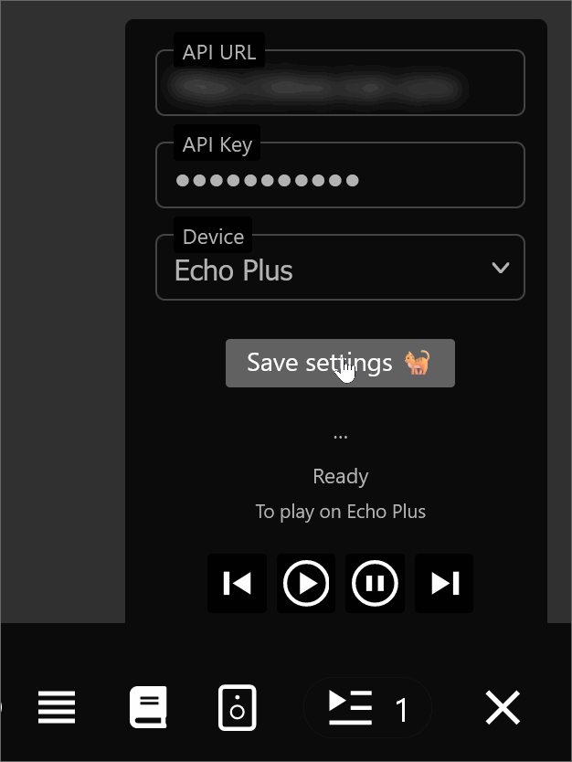

# navidrome-alexa

Stream your music from Navidrome UI to Amazon Echo & Alexa devices.

## How it works

Navidrome-Alexa is a combination of a UI widget, REST API and Alexa Skill that allow you to stream your music from
Navidrome Web UI to Alexa devices like Amazon Echo.
See the below diagram for details how components interact with each other.


### Why it works that way
See below for more details on Navidrome and Alexa integrations.

[ADR001 Alexa Interactions](doc/ADR001-Alexa-Interactions.md)    
[ADR002 Navidrome Integration](doc/ADR002-Navidrome-Integration.md)

### How it looks like
UI still needs a lot of work both on the look-and-feel side and how it integrates with Navidrome.



## Installation

### Prerequisites

- Public-web accessible address for navidrome-alexa to accept Amazon Alexa Skill API requests
- Public-web accessible address for Navidrome's /rest/stream endpoint 
- Reverse proxy with SSL and rewriting support ([Caddy](https://github.com/caddyserver/caddy) is used in example configuration below)
- Amazon account to access [Alexa Developer Console](https://developer.amazon.com/alexa/console/ask) to configure self-hosted Alexa Skill

### 1. Configure skill
This configures self-hosted Alexa skill that calls /skill endpoint of navidrome-alexa application
and provides music streams back to echo devices. 

- 1.1. Open [Alexa Developer Console](https://developer.amazon.com/alexa/console/ask) and authenticate.
- 1.2. Click "Create New Skill" button.
- 1.3. Enter "navi stream" as skill name
- 1.4. On the "Experience, Model, Hosting Service" screen select:
    - Choose a type of experience: "Music & Audio" [(picture)](doc/install-1-4-1.png)
    - Choose a model: "Custom" [(picture)](doc/install-1-4-2.png)
    - Hosting services: "Provision your own"
    - Click "Next" button
- 1.5. On the "Template" screen select "Start from Scratch" and click "Next" button [(picture)](doc/install-1-5.png)
- 1.6. On the "Review" screen click "Create Skill" button, wait till skill is created
- 1.7. Go to "Intents" in left side menu and hit "JSON editor", copy & paste [alexa-skill.json](doc/alexa-skill.json)
  and click "Save" [(picture)](doc/install-1-7.png)
- 1.8. Go to "Endpoint", select "HTTPS" as "Service Endpoint Type"  [(picture)](doc/install-1-8.png)
    - Enter public https URL pointing to your navidrome-alexa installation ending with /skill 
      (e.g. https://alexa.yourdomain.com/skill )
    - Select SSL certificate type you use (make sure to select wildcard cert type if using it for subdomains)
    - Click "Save" button
- 1.9. Go to "Interfaces" left side menu, enable "Audio Player" and press "Save" [(picture)](doc/install-1-9.png)
- 1.10. Click "Build" in top menu, click "Build skill" button, ensure skill builds successfully
- 1.11. Got to developer console root page and click "Copy Skill ID", you will need it for the next
  step.  [(picture)](doc/install-1-11.png)

### 2. Configure application
This configures navidrome-alexa application that provides /skill endpoint to serve music stream URLs to Alexa devices 
and /api endpoint to control queuing and playback.

- 2.1. Download a pre-built [release of navidrome-alexa](https://github.com/Ahimgit/navidrome-alexa/releases) or build locally.
- 2.2. Run it passing configuration parameters below:

| Command line         | Env var | Default value | Description                                                                                          |
|----------------------|---------|---------------|------------------------------------------------------------------------------------------------------|
| amazonDomain         |         | amazon.com    | Base domain to use for Alexa API calls.                                                              |
| amazonCookiePath     |         | cookies.data  | Path to a writable file to store auth cookies.                                                       |   
| amazonUser           |         | _Empty_       | Amazon account email with Alexa devices, can be left blank if auth cookies already exist.            | 
| amazonPassword       |         | _Empty_       | Amazon account password, can be left blank if auth cookies already exist.                            | 
| apiKey               |         | _Empty_       | Required. API key to authenticate /client calls. User provided, select arbitrary string to match 4.1 |         
| streamDomain         |         | _Empty_       | Required. Navidrome public server domain URL.                                                        |         
| alexaSkillId         |         | _Empty_       | Required. Skill id to authenticate calls from Alexa. Has to match copied in 1.11.                    |     
| alexaSkillName       |         | navi stream   | Skill invocation name. Has to match name configured in 1.7. JSON                                     |                           
| listenAddress        |         | :8080         | Listen address.                                                                                      |                                  
| logIncomingRequests  |         | false         | Log API and Skill requests/responses.                                                                |            
| logOutgoingRequests  |         | false         | Log outgoing (to Alexa APIs) requests/responses. **Will leak sensitive data into logs.**             | 

Minimal configuration via command line example:

```shell
  na \
  -amazonUser your@email.com \
  -amazonPassword youramazonpassword \
  -apiKey yourlongenoughandsecureapikey \
  -alexaSkillId amzn1.ask.skill.xxxxx \
  -streamDomain https://navidrome.youdomain.com \ 
```
Note that Amazon may challenge you with CAPTCHA and this will require logging into mobile app from the same network to clear oauth/openid flow.
You can also test Amazon Alexa authentication / generate cookie file with `meow` command 

```shell 
  meow amazon.com your_amazon_user@email.com your_amazon_password
```

### 3. Configure proxy
This configures reverse proxy re-write rule that injects navidrome-alexa UI widget into Navidrome UI.
Caddy is used as example configuration. Below examples assume that navidrome and navidrome-alexa are running on their default ports 
and on the same host as Caddy (localhost).

- 3.1 Add public address for navidrome-alexa in Caddy config, this has to match URL configured in step 1.8.
  ```
  alexa.yourdomain.com {
      reverse_proxy localhost:8080
  }
  ```

- 3.2 Add rewrite rule to inject widget into Navidrome's UI. Navidrome-alexa /proxy endpoint simply concats real navidrome UI js with the widget js.
  Note that `main.0b7df61b.js` script name is Navidrome release [0.51.1](https://github.com/navidrome/navidrome/releases/tag/v0.51.1) specific and needs to be updated with each release.  
  ```
  navi.yourdomain.com {
    reverse_proxy localhost:4533
    handle /app/static/js/main.0b7df61b.js {
      rewrite * /proxy?proxied=http://localhost:4533/app/static/js/main.0b7df61b.js
      reverse_proxy http://localhost:8080
    }
  }
  ```
- 3.3. Verify that script now contains widget code with `curl -v http://navi.yourdomain.com/app/static/js/main.0b7df61b.js`
 
### 4. Configure widget
If widget was injected successfully when opening Navidrome UI, there will be a new button on the player bar.
- 4.1 Click on the speaker button, click on three dots ... [(picture)](doc/install-4-1.png)
- 4.2 Configure settings and click Save
  - Configure API URL (e.g. https://alexa.yourdomain.com) to match 1.8 and 3.1.
  - Configure API Key to match apiKey selected when starting navidrome-alexa in 2.2
  - If everything was configured correctly you should be able to select your device and play music 

### 5. Play
Add music to the Navidrome UI player queue and press play "⏵" button on the widget.

## Monitoring

### Monitoring
Navidrome-alexa has endpoint metrics exposed via Prometheus/OpenMetrics endpoint at `/metrics`.    
There is also a basic cached healthcheck endpoint at `/health`
If you want to exclude those from public access you can configure a rule to do so:
```
  alexa.yourdomain.com {
      @exclude not path /health/* /metrics/* /metrics /health 
      reverse_proxy @exclude localhost:4533
  }
```

### Logging
To enable request/response logging for REST endpoints and Alexa client use configuration options `logIncomingRequests` and `logOutgoingRequests`.
**This will leak potentially sensitive data (like authentication tokens) into log files.**

## Setting up development environment

### Building locally
Run in root project folder
```shell
go build -o ./build/ ./...
``` 
You can also use provided build script to run static checks, tests and build.

### Running tests
```shell
go test ./...    
```
There is severe lack of tests currently.

## Known issues & todo
- No re-authentication in Alexa client, if cookie token is revoked for some reason `cookies.data` needs to be deleted (
  although they have 1 year expiry)
- Authentication may be tricky and may require authing from a mobile app on the same network first to do CAPTCHA. 
- Better/more secure way of setting configuration params
- Proper integration with Navidrome vs injected widget
- Better UI for playback controls / progress
- Volume controls
- Separate port for /health & /metrics
- Proper signature validation of incoming /skill requests
- Per-device queue / state
- More control over logging configuration
- More (than zero) tests